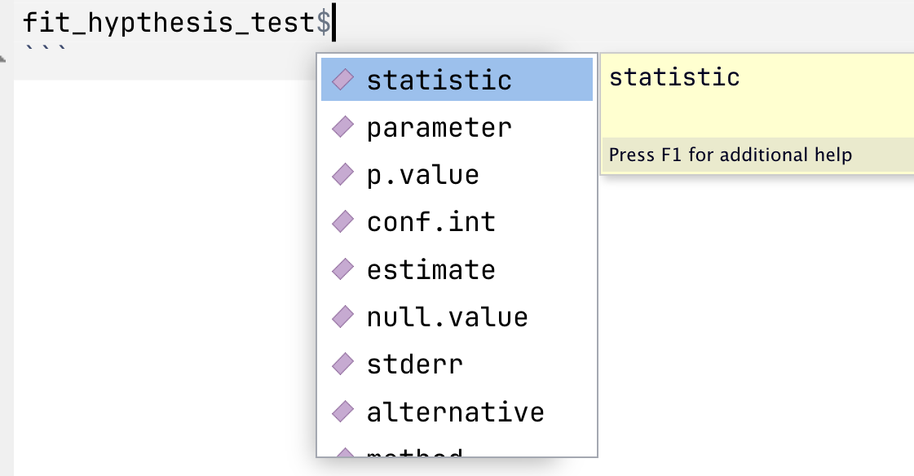

# Analysis functions <span class="badge badge-draft3">✎ Polishing</span>

```{r}
#| include: false
# if it is available, run the setup script that tells quarto to round all df/tibble outputs to three decimal places
if(file.exists("../_setup.R")){source("../_setup.R")}
```

Monte Carlo simulations involve generating data, analyzing data, and repeating this multiple times. In the last chapter you learned how to write functions to generate tidy data for analysis. In this chapter you'll learn how to analyze data and return tidy results, so that it can be repeated many times.

Many of us are used to running analyses a small number of times, and therefore working with the default output of R's analysis functions. For example, below we have simulated some data for an RCT on psychotherapy where depression is measured in both groups after the treatment (or waiting-list control).

We use a Student's *t*-test to estimate the difference in the sample means between groups and make an inference about whether the population means differ - i.e., whether the treatment is effective.  

```{r}
#| include: false
# create dataset to be used

# install the devtools and truffle packages if you don't have them already:
# library(devtools)
# install_github("ianhussey/truffle")
library(truffle)
library(tibble)
library(dplyr)

dat_depression_rct <- 
  truffle_likert(study_design = "factorial_between2",
                 n_per_condition = 25,
                 factors  = "X1_latent",
                 prefixes = "X1_item",
                 alpha = .80,
                 n_items = 13,
                 n_levels = 4,
                 approx_d_between_groups = 0.70,
                 seed = 45) |>
  snuffle_sum_scores("X1_", 
                     min = 1, 
                     max = 4, 
                     id_col = "id") |>
  select(id, condition, score = X1_sumscore) |>
  mutate(score = score - 13) |>
  truffle_demographics()
```


```{r}
# fit t test
fit_hypthesis_test <- t.test(
  formula = score ~ condition,
  var.equal = TRUE, # students t test: assumes equal variances
  data = dat_depression_rct # simulated in a previous chunk not visible in the ebook
)

# return the results using the function's print method
fit_hypthesis_test %>%
  print()
```

The output of `t.test()` does what we need to: we get estimates of the means and the *p*-value for the difference. But the output is very non-tidy. Of course, we could work with the list object that function returns, which has the following elements and values:

```{r}
# return the results as the literal contents of the list object
fit_hypthesis_test %>%
  unclass() %>%
  print()
```

List objects can be tricky to work with. Instead, we will try to stay within the tidyverse workflow that returns tidy, tabular data (i.e., a tibble) by writing an analysis function around `t.test()`. 

## Tidy data as format standardization

A useful analogy here is that, in the past, cargo ships carried irregularly sized cargo. Before 1956, it would take a week or more to load or unload a large cargo ship, at an average of just over one tonne of cargo per hour. Because of this, ships usually spent 50% of their life being loaded and unloaded. 

{.center width="60%"}

The invention of the standardized shipping container, the Twenty-foot Equivalent Unit (TEU), had a massive impact on global trade. Because of their standardized shape, they can be loaded or unloaded at roughly 5000 tonnes per hour - thousands of times more efficiently. Sure, the robots and logistics systems are part of this improved efficiency, but much of the benefit comes from simply standardizing the inputs and outputs to follow a similar structure.

{.center width="60%"}

This book is written around a similar philosophy: that we can learn to write simulations, and reuse code more between simulations, when they employ tidy inputs and outputs. 

Even if the steps within a given function are more complex, the inputs and outputs of a each function should be either single value parameters or tidy data frames. Making the inputs and outputs of the function **modular** like this means that they can be reused or modified for new purposes.

{.center width="100%"}

## Writing analysis functions

### Accessing models' results

To be able to write 'wrapper' functions for existing analysis functions that return tidy outputs, we often need to access elements of the lists (or other objects) those functions return. 

Just like writing the 'do stuff' part of any function, this is much easier to write as normal code to get it working once, before later wrapping it in a function.

If you have already fit a model and assigned its results to an object, like `fit_hypthesis_test` above, you can then access previews of its elements using `$`:

{.center width="50%"}


```{r}
#| eval: false
#| include: false
# practice exploring and printing different elements by adding a `$` after the object: 
fit_hypthesis_test
```

You can also use `unclass()` and then print an object to see all its elements. This stops the `print()` method for that object type converting it to a summary (i.e., the difference between `print(fit_hypthesis_test)` and `print(unclass(fit_hypthesis_test))`.).

```{r}
# return the results as the literal contents of the list object
unclass(fit_hypthesis_test)
```

### Write the 'do stuff'

This allows you to write code for the various elements you want to extract. For example, for the *t*-test we might want the following.

```{r}
fit_hypthesis_test$statistic
fit_hypthesis_test$parameter
fit_hypthesis_test$p.value
fit_hypthesis_test$estimate
```

At this point, it's worth pointing out that the `t.test()` function does not fully do what it is intended to. 

Recall that a *t*-test a) estimates the differences between two groups' sample means and b) produces a *p*-value to allow the user to make an inferenence regarding whether the population means are likely to differ or not.

As [Uri Simonsohn recently pointed this out in a blog post](https://datacolada.org/132), `t.test()` doesn't actually do (a)! It doesn't produce an estimate of the *difference* between the two sample means, only estimates of the mean in each sample. This is a bit odd, given that it does provide the 95% Confidence Intervals around this different in means, just not the difference in means itself (see '95 percent confidence interval:' in the above output). 

If you want to estimate the *difference* between them, you have to calculate this yourself.

```{r}
unname(fit_hypthesis_test$estimate[1] - fit_hypthesis_test$estimate[2])
```

Now that we have each of these, we can assemble them as a tibble. We'll repeat the code that runs the analysis here so that you can see we have all the code for the 'do stuff' now.

```{r}
fit_hypthesis_test <- t.test(
  formula = score ~ condition,
  var.equal = TRUE, # students t test: assumes equal variances
  data = dat_depression_rct # simulated in a previous chunk not visible in the ebook
)

tibble(
  t = fit_hypthesis_test$statistic,
  df = fit_hypthesis_test$parameter,
  p = fit_hypthesis_test$p.value,
  mean_diff = unname(fit_hypthesis_test$estimate[1] - fit_hypthesis_test$estimate[2])
)
```

### Wrap as a function

Now we can wrap it as a function. No need to get fancy with this and make it highly flexible: it takes only one input (the data) and assumes that the type of test (Student's *t*-test rather than Welch's *t*-test) and the names of the variables (`score ~ data`).

```{r}
# define function
analyse_data <- function(data){
  fit <- t.test(
    formula = score ~ condition,
    var.equal = TRUE, # students t test: assumes equal variances
    data = data 
  )
  
  res <- tibble(
    t = fit$statistic,
    df = fit$parameter,
    p = fit$p.value,
    mean_diff = unname(fit$estimate[1] - fit$estimate[2])
  )
  
  return(res)
}

# usage
analyse_data(dat_depression_rct)
```

::: {.callout-note collapse="true" title = "What should you now do, following the usual steps of writing a function?"}
You must always sanity test your function to make sure that the code does not merely run, but that it performs as intended. 

One of the easiest ways to do so is via parameter recovery.

Create a dataset that simulates two conditions, uses a very large sample size (eg n = 10000) and a large population difference in means. Write this as a Data Generating Process function. Generate a dataset using the function, then supply this data to the data analysis function and ensure that you recover a sample estimate close to the population parameters. 

This exercise is as much about practicing your skills writing data generating process functions as your sanity testing/parameter recovery skills.

```{r}


```
:::

### The parameters library

Because extracting model parameters is such a common task, R libraries have been written specifically for this purpose. The [{parameters}](https://easystats.github.io/parameters/) package is in the {easystats} universe of packages, all of which play nicely with {tidyverse} code.

`parameters::model_parameters()` extracts many different analysis functions' results as a data frame.

```{r}
library(parameters)
library(janitor)

model_parameters(fit_hypthesis_test) %>%
  as_tibble() # convert to tibble to print the tibble rather than via the print() method
```

Does this render the above lesson on how to do this yourself obsolete? Mostly yes. But it's important do know how to do it yourself, as not all model types are accomodated by {parameters}.

We can still wrangle this further if we:

- Want to select only some of these columns
- Need to prevent duplicate names that would cause problems later
- Want to clarify variables names
- Prefer a different naming convention

```{r}
model_parameters(fit_hypthesis_test) %>%
  as_tibble() %>% # convert to tibble 
  # we are in the habit of using snake_case for naming, so convert. the janitor package has a function for this.
  janitor::clean_names() %>% 
  # despite how good {parameters} is, we may need to rename columns for clarity or to prevent duplicates later
  # select-and-rename the columns of interest
  select(t,
         df = df_error,
         p,
         mean_diff = difference,
         mean_diff_ci_low = ci_low,
         mean_diff_ci_high = ci_high)
```

## Writing more flexible functions

### Additional arguments 

We often want our analysis function to take arguments other than just the data to be analyzed. For example, instead of forcing the use of a Student's *t*-test via `var.equal = TRUE`, we might want to choose wehteh to use a Students' *t*-test (`var.equal = TRUE`) or Welch's *t*-test (`var.equal = FALSE`) each time we call the function. 

- How would you do this?
- How would you specify defaults?

Look back to the [chapter on Writing Functions](../exercises/3_writing_functions.qmd) to refresh your memory. 

### Interpolating column names via the curly-curly operator (`{{ }}`) 

There can be cases where we need a more flexible function so that it can take take variables other than `score` and `condition`. 

However, this isn't quite as easy to do. The ways that might be intuitive won't work. 

```{r}
#| eval: false
#| include: true
# 'dv' and 'iv' have been made input arguments and used in the formula
analyse_data <- function(data, dv, iv){
  fit <- t.test(
    formula = dv ~ iv,
    var.equal = TRUE, # students t test: assumes equal variances
    data = data 
  )
  
  res <- tibble(
    t = fit$statistic,
    df = fit$parameter,
    p = fit$p.value,
    mean_diff = unname(fit$estimate[1] - fit$estimate[2])
  )
  
  return(res)
}

# however, none of these will work:
# 1. 
analyse_data(data = dat_depression_rct, 
             dv = score,
             iv = condition)
# > Error: object 'score' not found

# 2.
analyse_data(data = dat_depression_rct, 
             dv = "score",
             iv = "condition")
# > Error in t.test.formula(formula = dv ~ iv, var.equal = TRUE, data = data) :
# >   grouping factor must have exactly 2 levels

# 3.
# neither will defining the function as `formula = "dv" ~ "iv",` etc.
```

This is because `score` and `condition` are neither values nor objects, but elements of another object (i.e., columns in the `data` tibble). 

There are other ways to solve this, but a convenient one is the use of the 'curly-curly' operator, `{{ column }}`. While these can't be used directly in `formula`, they can be called in a tidy workflow to rename columns just before they're used.

```{r}
# define function
analyse_data <- function(data, dv, iv){
  data_renamed <- data %>%
    rename(dv = {{ dv }},
           iv = {{ iv }})

  fit <- t.test(
    formula = dv ~ iv,
    var.equal = TRUE, # students t test: assumes equal variances
    data = data_renamed 
  )
  
  res <- tibble(
    t = fit$statistic,
    df = fit$parameter,
    p = fit$p.value,
    mean_diff = unname(fit$estimate[1] - fit$estimate[2])
  )
  
  return(res)
}

# usage
analyse_data(data = dat_depression_rct, 
             dv   = score,
             iv   = condition)
```

::: {.callout-tip title = "Practice writing analysis functions"}
Ready to practice? 
Download and complete the [exercises for this chapter](../exercises/6_analysis_functions_exercises.qmd).
:::

