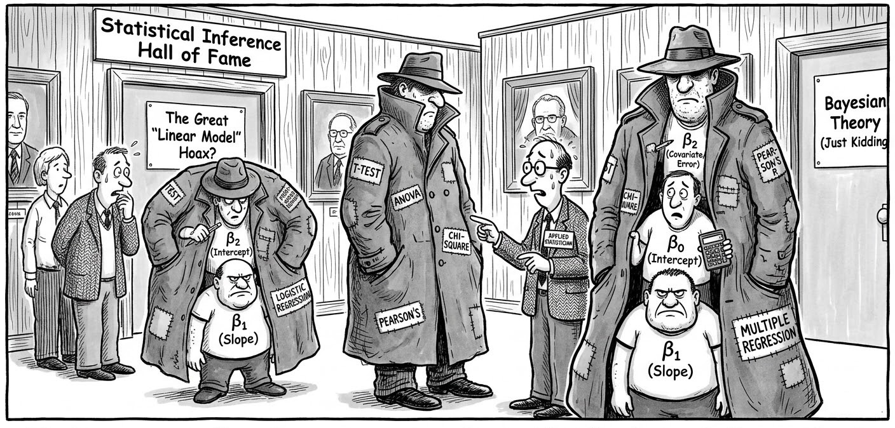
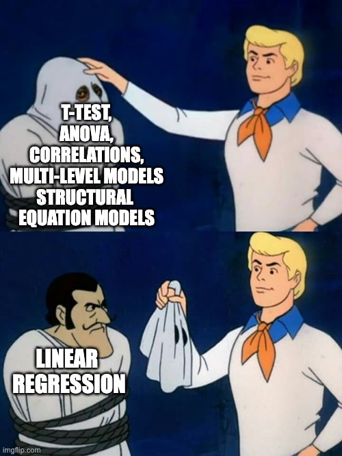

# Everything is regression <span class="badge badge-draft2">✎ Rough draft</span>

```{r}
#| include: false
# if it is available, run the setup script that tells quarto to round all df/tibble outputs to three decimal places
if(file.exists("../_setup.R")){source("../_setup.R")}
```

Ok not everything. But a large proportion of the most commonly used statistical methods are just a linear regression model hiding in a trench coat.

{.center width="90%"}

This chapter uses the data simulation principles and skills you learned in the chapters in Part I to demonstrate this.  

This chapter is heavily inspired by Jonas Lindeløv's blog post ['Common statistical tests are linear models (or: how to teach stats)'](https://lindeloev.github.io/tests-as-linear). We recommend you read his post in its entirety. We agree with Lindeløv that it might be better to frame much of our teaching of statistical inference around this insight, rather than introducing it very late in our training. 

## Many tests are just regression

{.center width="90%"}

### Correlations are linear regression models

Correlations are just a linear regression model where the IV and DV have both been standardized by their sample Standard Deviations (i.e., score/SD).

Whereas the Beta coefficient from the linear regression model is interpreted as "a one-point increase in the IV is associated with a [Beta]-points change on the DV", the Pearson's *r* correlation merely modifies the units from the native scale to the number of Standard Deviations. I.e., "a one-SD increase in the IV is associated with a [Beta]-SD changes (aka *r*) on the DV".

```{r}
# dependencies
library(faux)
library(tibble)
library(dplyr)
library(parameters)
library(janitor)
library(effectsize)
library(forcats)

# simulate some cross sectional data 
set.seed(43)

data_crosssectional <- faux::rnorm_multi(
  n = 600,
  vars = 2, 
  varnames = c("x", "y"),
  mu = c(0, 0.5), 
  sd = 1, 
  r = 0.35 
) 
```

Note equivalent estimates (*r* = .36):

```{r}
fit_named <- cor.test(formula = ~ y + x, 
                      data = data_crosssectional,
                      method = "pearson") 

model_parameters(fit_named)
```

```{r}
fit_lm <- lm(formula = scale(y) ~ 1 + scale(x),
             data = data_crosssectional) 

model_parameters(fit_lm)
```

### *t*-test are linear regression models

*t*-tests are just linear regression models where the IV - the group variable - has been dummy-coded, e.g., from control/intervention to 0/1.

Whereas the Beta coefficient from the linear regression model is interpreted as "a one-point increase in the IV is associated with a [Beta]-points change on the DV", the *t*-test merely modifies this by treating "0" as one condition and "1" as the other. I.e., "a one-point increase in the IV, aka the difference between conditions, is associated with a [Beta]-points change (aka $M_{diff}$) on the DV". 

```{r}
#| include: false
set.seed(42)
# simulate some experiment data
dat_experiment <- 
  bind_rows(
    tibble(condition = rep("intervention", 40),
           score = rnorm(n = 40, mean = 0.45, sd = 1)),
    tibble(condition = rep("control", 40),
           score = rnorm(n = 40, mean = 0, sd = 1))
  ) %>%
  mutate(condition = fct_relevel(condition, "intervention", "control"),
         condition_numeric = case_when(condition == "intervention" ~ 1,
                                       condition == "control" ~ 0))
```

Note equivalent estimates of the difference in means ($M_{diff}$ = 0.33) and *p*-values (*p* = .175).

```{r}
fit_named <- t.test(formula = score ~ condition, 
                    data = dat_experiment,
                    var.equal = TRUE)

model_parameters(fit_named)
```

```{r}
fit_lm <- lm(score ~ 1 + condition_numeric,
             data = dat_experiment)

model_parameters(fit_lm)
```

### Many non-parametric tests are just linear models with transformations

When the assumptions of parametric tests like *t*-tests and correlations fail, we are often recommended to use 'non-parametric' tests instead. Many of these are just linear models with rank transformations.

#### Spearman's $\rho$ correlations 

Note equivalent estimates ($\rho$ = .34):

```{r}
fit_named <- cor.test(formula = ~ y + x, 
                      data = data_crosssectional,
                      method = "spearman") 

model_parameters(fit_named)
```

```{r}
fit_lm <- lm(formula = rank(y) ~ 1 + rank(x),
             data = data_crosssectional) 

model_parameters(fit_lm)
```

#### Mann-Whitney U-test (aka Wilcoxon rank-sum test) 

Note equivalent estimates of the difference in *p*-values (*p* = .183).

```{r}
fit_named <- wilcox.test(formula = score ~ condition, 
                         data = dat_experiment, 
                         correct = FALSE) # without continuity correction

model_parameters(fit_named)
```

```{r}
fit_lm <- lm(rank(score) ~ 1 + condition_numeric,
             data = dat_experiment)

model_parameters(fit_lm)
```

### Meta-analyses are linear regression models

Specifically, linear models that weight by the sample size (in much older studies) or the effect size's variance (in modern meta analyses) so that larger studies with more precisely estimated effect sizes influence the meta-analysis estimate more. You can see in the forest plot below that the more precise estimates - those with narrower Confidence Intervals - have larger weights, represented by the larger squares. Psychology doesn't use regression weightings in non-meta-analysis contexts very often, but [perhaps we should (Alsalti, Hussey, Elson and Arslan, 2026)](https://doi.org/10.1525/collabra.155850).

The other main conceptual difference between meta-analyses and original analyses is that meta-analyses typically use the results of original studies as their data (i.e., effect size estimates), rather than the underlying original data itself. However, this is still something we can use the linear regression functions for, simply by supplying it with effect size estimates rather than participant-level data.  

See [this helpful blog post](https://www.metafor-project.org/doku.php/tips:rma_vs_lm_lme_lmer) by Wolfgang Viechtbauer, the developer of the {metafor} package for meta-analysis, for more details of this underlying equivalence and the small implementation differences between R packages and methods. 

Note equivalent estimates of the meta-analysis effect size (*r* = .13).

```{r}
#| fig-height: 5
#| fig-width: 7
library(metafor)

data_meta <- 
  escalc(measure = "COR", 
         ri = ri, 
         ni = ni, 
         data = dat.molloy2014) %>% # use metafor's built-in dataset 
  select(authors, 
         year, 
         pearsons_r = yi,
         pearsons_r_variance = vi)

# fit an equal-effects meta-analysis model 
# these are less commonly recommended these days, but it illustrates the point
fit_meta <- rma(yi = pearsons_r, 
                vi = pearsons_r_variance, 
                data = data_meta, 
                method = "EE") 

forest(fit_meta, slab = paste(authors, year))

# model_parameters(fit_meta) # optionally, print table to see that model_parameters() works with many different models
```

```{r}
fit_lm <- lm(pearsons_r ~ 1, 
             weights = 1/pearsons_r_variance, 
             data = data_meta)

model_parameters(fit_lm)
```

### Means and Standard Deviations are linear regression models

If we want to take this even further, we can see that other named 'tests' that are just linear regression models even includes 'the sample mean' and 'the sample Standard Deviation' of an intercept-only linear regression model. 

An intercept-only linear regression model has no predictors, only the intercept. Eg., `y ~ 1`.

The sample mean is the estimate of the intercept of an intercept-only linear regression model.

The sample Standard Deviation is the estimate of the residual standard error of an intercept-only linear regression model.

Note the equivalent estimates.

```{r}
fit_named <- dat_experiment |>
  summarize(mean = mean(score),
            sd = sd(score))

fit_named
```

```{r}
fit_lm <- lm(formula = score ~ 1,
             data = dat_experiment)

model_parameters(fit_lm) 

sigma(fit_lm) # residual standard error
```

## Regression is just the slope of a line

### Linking different notation types

Equation of a line as we are taught in school:

$$
y = m*x + c
$$

Bridge from school notation to linear regression notation:

$$
\underbrace{y}_{\text{outcome}} = \underbrace{c}_{\beta_{\text{intercept}}} \cdot \underbrace{1}_{\text{intercept}} + \underbrace{m}_{\beta_{\text{slope}}} \cdot \underbrace{x}_{\text{predictor}} + \underbrace{\varepsilon}_{\text{error}}
$$

The linear model notation:

$$
y = \beta_{\text{intercept}} \cdot 1 + \beta_{\text{slope}} \cdot x + \varepsilon
$$

'Wilkinson notation' to specify and fit the regression in R:

```{r}
#| include: false
# simulate some cross sectional data 
set.seed(43)

# y = sleep measured by the PSQI
# x = depression measured by the BDI-II
dat <- faux::rnorm_multi(
  n = 600,
  vars = 2,
  varnames = c("x", "y"), 
  mu = c(15, 6.5),
  sd = c(10, 3.5),
  r = 0.57
) %>%
  as_tibble()
```

```{r}
fit <- lm(y ~ 1 + x, 
          data = dat)
```

This asks R to estimate $\beta_{\text{intercept}}$ for 1 (the intercept), $\beta_{\text{slope}}$ for x, and the remaining error $\varepsilon$. 

We can then see those estimates, where 'Coefficient' refers to the Beta coefficients:

```{r}
model_parameters(fit) 
```

However, because the above code doesn't explicitly mention the Beta parameters, its connection to the formula can feel unclear. We think it can be helpful to see the same model specified in the {lavaan} package, which does let you explicitly name these parameters in the model. 

```{r}
library(lavaan)

fit <- lavaan::sem(model = 'y ~ beta_intercept * 1 + beta_slope * x', 
                   data = dat)
```

We can then see the estimates again. Note that because {lavaan} uses Maximum Likelihood estimation rather than Ordinary Least Squares estimation it will provide slightly different results - the point is just to see the connection between the formula and the model.

```{r}
# nb model_parameters() doesn't return the intercept so extract it more manually
lavaan::parameterEstimates(fit) |>
  filter(label %in% c("beta_intercept", "beta_slope")) %>%
  select(label, beta = est, ci_low = ci.lower, ci_high = ci.upper, p = pvalue)
```

### Understanding regression as prediction

Beta estimates often feel highly abstract. We can understand them better in the context of the original linear regression formula, as a way to make predictions about new observations.

To do this, we simply use the regression formula and the estimates from the model. Insert the estimates for $\beta_{\text{intercept}}$ and $\beta_{\text{slope}}$ into the original regression equation. 

Then, add a new value of $x$ to represent a hypothetical new participant. Let's imagine this participant has a depression score ($x$) of 25 on the BDI-II, representing moderate depression. 

By multiplying the numbers, we find the participant's predicted sleep score on the PSQI ($y$).

$$
\begin{aligned}
y &= \beta_{\text{intercept}} \cdot 1 &+& \quad \beta_{\text{slope}} \cdot x \\
  &= 3.5                     \cdot 1 &+& \quad 0.2 \cdot 25 \\
  &= 8.5
\end{aligned}
$$

Predicted sleep quality is 8, where scores on the PSQI > 5 indicate poor sleep and clinical populations often score in the 8 to 14 range.

### Linking the formula to Null Hypothesis Significance Testing (NHST)/*p* values

The association between depression and sleep quality is tested against the null hypothesis ($H_0$) that the association between $x$ and $y$ - ie $\beta_{\text{slope}}$ - is zero. The alternative hypothesis ($H_1$) is therefore that the association is non-zero. Non-zero slope allows for the inference that depression is associated with poor sleep. 

$$
H_0\!: \beta_{\text{slope}} = 0 
\\
H_1\!: \beta_{\text{slope}} \neq 0
$$

Inferences regarding whether the slope is non-zero *in the population rather than the sample* are based on quantifying the uncertainty around the estimate of $\beta_{\text{slope}}$, for example through Confidence Intervals and *p*-values. We won't get into how that is done here; the point here is to link *p*-values (which you are likely more familiar with) to the slope of the line equation underlying linear regression (which are may be less familar with). 

::: {.callout-tip title = "Practice testing the equivalence of named tests and linear regression"}
Note that while there are exercises related to this chapter, we suggest that you do **not** complete them until you have read all of Part 1 of the book (learning how to simulate).

Download and complete the [exercises for this chapter](../exercises/11_everything_is_regression_exercises.qmd).
:::
