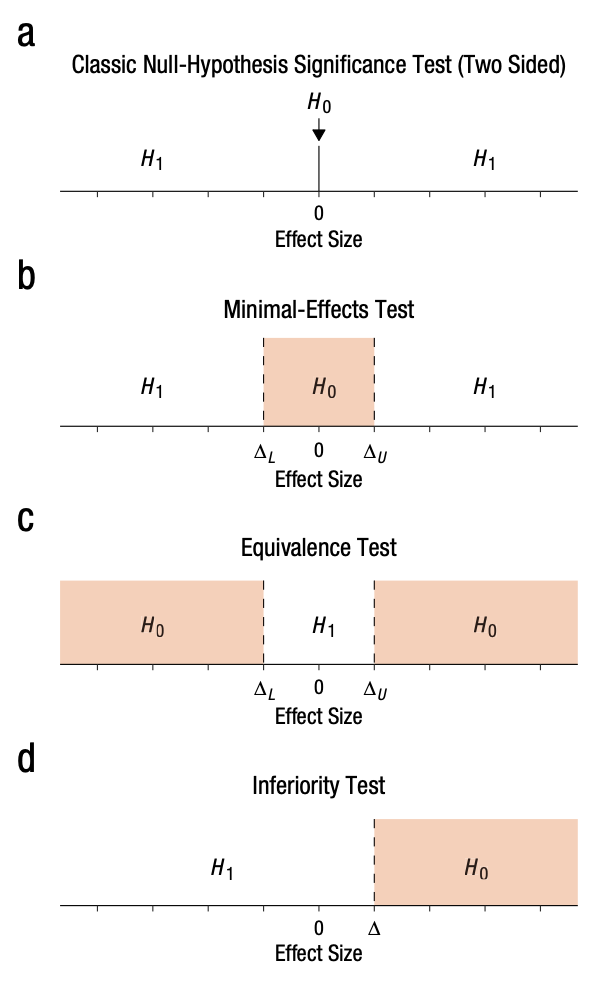

# Estimation <span class="badge badge-draft1">✎ Very rough draft</span>

```{r}
#| include: false
# if it is available, run the setup script that tells quarto to round all df/tibble outputs to three decimal places
if(file.exists("../_setup.R")){source("../_setup.R")}
```

```{r}
# dependencies
library(tidyr)
library(dplyr)
library(furrr) 
library(parameters)
library(stringr)
library(forcats)
library(ggplot2)
library(scales)
library(ggstance)
library(patchwork)
library(janitor)
library(effectsize)

# set up parallelization
plan(multisession)
```

## TODO

- distribution of p values; barely significant values are rare.
- relationship between CI and p value
- false positive rate (alpha)
- false negative rate (power)
- different forms of hypothesis testing (zero point, non-inferiority etc, SESOI)


## Mean difference-in-means and power by sample size

```{r fig.height=5, fig.width=6}
p2 <- ggplot(simulation_summary, aes(n_per_condition*2, proportion_significant)) +
  geom_point() +
  geom_hline(yintercept = 0.05, linetype = "dotted") +
  geom_hline(yintercept = 0.80, linetype = "dotted") +
  scale_x_continuous(breaks = breaks_pretty(n = 10),
                     name = "Total sample size") +
  scale_y_continuous(breaks = breaks_pretty(n = 5),
                     limits = c(0,1),
                     name = "Proportion of significant\np-values") +
  theme_linedraw() 

p1 + p2 + plot_layout(ncol = 1)
```


## Exercise: Power for equivalence test

See Lakens et al., 2018 for a tutorial on the concepts below.

Using a Smallest Effect Size of Interest (SESOI) of difference-in-means = 0.2, what is the power of a Two One-Sided Equivalence Test (TOST) for different sample sizes? What N is needed for 80% power to detect a true null effect size as equivalent to zero?

Note: because reasons, use the 90% Confidence Interval instead of 95 (see Lakens et al., 2018).

```{r}
if(file.exists("../images/lakens et al 2018 figure 1.png")){
  
}
```


