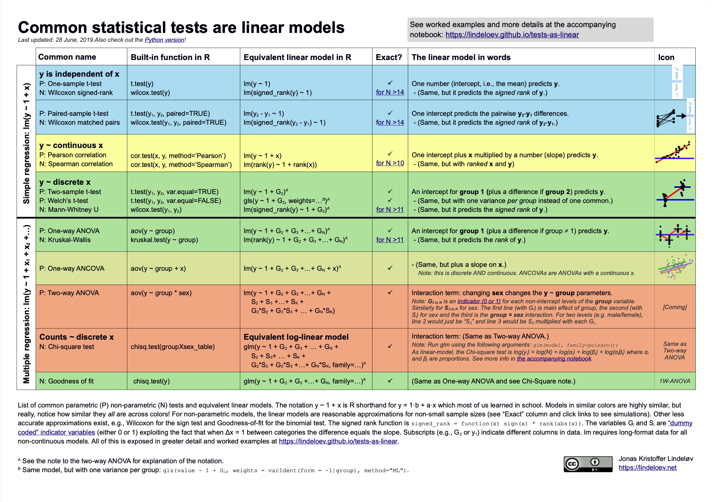

# Exercises for 'Everything is regression' chapter 

```{r}
#| include: false
# if it is available, run the setup script that tells quarto to round all df/tibble outputs to three decimal places
if(file.exists("../_setup.R")){source("../_setup.R")}
```

*Note:* we suggest that you do not complete this assignment immediately after reading the 'Everything is regression' chapter, but instead return to it later after you have read all of Part 1 of the book (learning how to simulate).

In a blog post, Jonas Lindeløv's points out that most [common statistical tests are linear models](https://lindeloev.github.io/tests-as-linear).

In the 'Everything is regression' chapter, we took several of these 'named tests' and showed that they were equivalent to linear regression models using `lm()`, e.g., for their *p*-value or effect size estimate.

We did this for:

- Mean and standard deviations
- Pearson's *r* correlations
- Spearman's rho correlations
- Students' *t*-tests
- Mann-Whitney U-tests
- (Equal effects) meta-analyses

This also holds for other tests, including different forms of ANOVA and (if we move from linear models to generalized linear models) Chi-square tests among other things. Lindeløv summarizes this in a useful infographic:



However, in the chapter, we only compared each named test with linear regression using a *single* dataset.

... A *single* dataset? In a course on simulation, where you learn to validate statistical methods by simulating thousands of datasets under a variety of different conditions?? 


In this set of exercises, we suggest that you practice the skills you learned in the chapters in Part 1 by implementing simulations to test the equivalence between named tests and linear models. 

Choose one or more named tests, generate data from a suitable DGP, and fit both the named test and the linear regression to each dataset. Test for equivalence of the results between them, across a range of experiment conditions and a large number of iterations. 

Note that when checking if two *p* values are equivalent you will run into the weirdness of "floating point arithmetic". Instead of doing something like `mutate(p_values_match = p_named_test == p_lm)` instead use `dplyr::near()`, e.g., `mutate(p_values_match = near(p_named_test, p_lm)` (see Ian's other book for more)](https://ianhussey.quarto.pub/reproducible-data-processing-and-visualization/chapters/strings_and_factors.html). You might also want to round each *p* value to (for example) five or six decimal places before testing for equivalence. 


